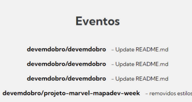
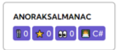
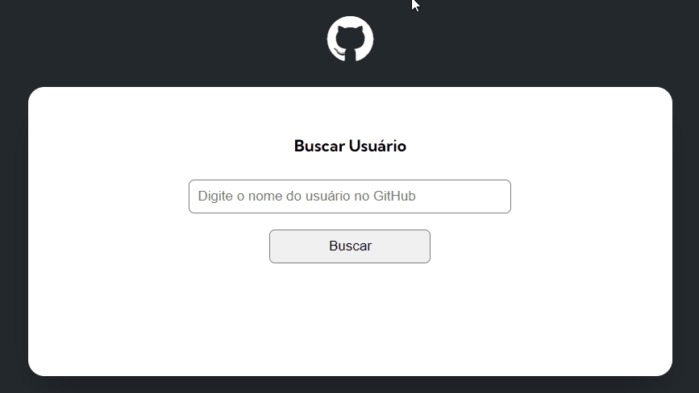

# projeto-inicial-fetch-github-api / Curso Devquest
 Projeto proposto no módulo avançado de Javascript. Através deste projeto, exploramos a API do GitHub para extrair informações específicas de um usuário, como foto do perfil, nome, bio e muito mais.

 Fizemos a validação, para quando o cliente procurar por um usuário que não existe.

## O desafio

Depois de aprender a trabalhar com a API, para extrair algumas informaçoes, o desafio consistiu em adicionar informações adicionais em três etapas:

<details>
<summary>Primeira etapa</summary>

1. Número de seguidores do usuário.
2. Número de pessoas que o usuário está seguindo.
</details>
 
<details>
<summary>Segunda etapa</summary>

1. Apresentar lista com até 10 últimos eventos do usuário no Github. Apenas eventos do tipo CreateEvent e PushEvent.

2. Para cada evento, mostrar o nome do repositório e a mensagem do evento.

Veja como deve aparecer:


</details>

<details>

<summary>Terceira etapa:</summary>

Em relação aos repositórios, devo agora mostrar:
- Quantidade de forks do repositório.
- Quantidade de estrelas do repositório.
- Quantidade de watchers do repositório.
- Mostrar a linguagem de programação do repositório.

Veja como deve aparecer:


</details>
 
## Tecnologias

 - HTML
 - CSS
 - Javascript


### Resolução e considerações finais

Com este projeto, pude praticar muito a refatoração do código, organizando em arquivos separados, através de módulos.

- Para mostrar a linguagem do repositório, precisei corrigir um problema: Em alguns repositórios, aparece "Null" no campo da linguagem. Precisei acessar outro endpoint da API, para obter o objeto das linguagens daquele repositório. Na variável orderLanguages, atribui o método ``Object.keys()``, para extrai a primeira do índice e enviei para o campo "linguagem" no HTML. Na variável getLanguage, atribui o operador lógico "ou", criando uma validação para caso o repositório, ainda não possua nenhuma linguagem, inserindo uma mensagem.

```Javascript
for(const repo of user.repositories){
                const languages = await fetch(repo.languages_url)
                const responseLanguages = await languages.json()
                let orderLanguages = Object.keys(responseLanguages)
                let getLanguage = orderLanguages[0] || 'sem linguagem'
```

- Para acessar apenas os últimos 10 eventos, adicionei no final do endpoint:

- Fui um pouco além, e trabalhei com o método ``Date()`` e ``filter()``, para poder filtrar os repositórios a partir de uma determinada data. Após adicionar este filtro, também extrair apenas 10 repositórios, utilizando o método ``slice()``- (index.js)

```Javascript
        const repositoriesFiltered = repositoriesResponse.filter(repo => {
        const dataLimite = new Date('2023-01-01')
        return new Date(repo.created_at) >= dataLimite
    })

    const tenRepositories = repositoriesFiltered.slice(0, 10)
```

Este projeto desafiador representa uma oportunidade para aprimorar minhas habilidades em JavaScript. Considero-o complexo e significativo, proporcionando uma prática fundamental no desenvolvimento."

### Demonstração do projeto

